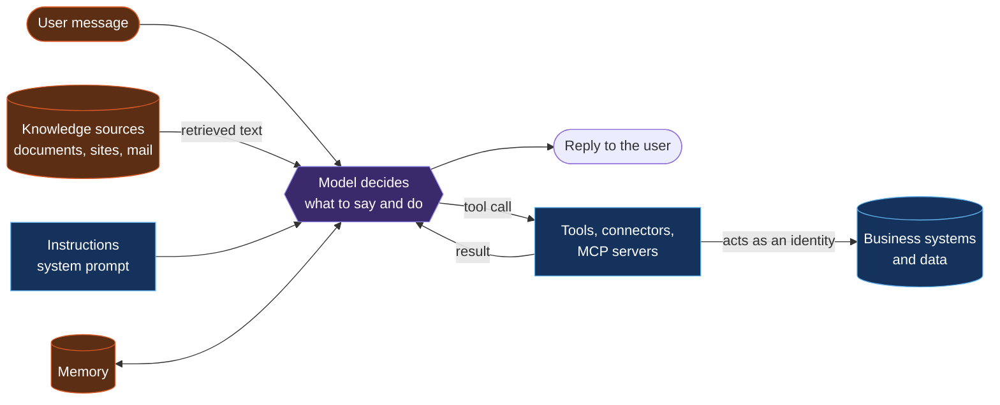

# 2. Threat model: map the agent before you probe it

[← Back to the playbook](../README.md)

Most serious findings come from what the agent is connected to, not from clever wording. Half an hour mapping the agent tells you where to spend the testing time.

## How an agent turns text into action

The orange boxes are **untrusted input**: anything in them may have been written by someone other than the agent's owner. The model cannot reliably tell instructions from data, so every orange box is a place an attacker can speak to the agent.

## Six questions that map the attack surface

| # | Ask | What a bad answer looks like |
|---|---|---|
| 1 | **Who can talk to it?** | Anyone, with no sign-in, or everyone in the tenant when ten people need it |
| 2 | **What does it read?** | Sources that outsiders can write to: inbound email, public web pages, shared folders, ticket descriptions |
| 3 | **What is in its instructions?** | Secrets, internal URLs, access rules that only work if nobody reads them |
| 4 | **What can it do?** | Tools that send, delete, pay or change permissions; more tools than its purpose needs |
| 5 | **Whose identity does it act as?** | The maker's own account, or a service identity with broad rights, so every user borrows that access |
| 6 | **Who approves and who watches?** | No approval on high-impact actions; no logging; nobody named as owner |

## From the map to the test plan

| If the map shows… | Prioritise |
|---|---|
| It reads content outsiders can write | Indirect prompt injection ([PI tests](03-test-catalogue.md#prompt-injection)) |
| Secrets or rules in the instructions | System prompt and secret extraction ([DL tests](03-test-catalogue.md#data-leakage)) |
| One identity shared by all users | Cross-user data access ([DL tests](03-test-catalogue.md#data-leakage)) |
| Tools with real effect | Unauthorised and unapproved actions ([EP tests](03-test-catalogue.md#excessive-permissions)) |
| Public or customer-facing channel | Role and scope tests ([UC tests](03-test-catalogue.md#unsafe-content)) |

## The lethal combination

The findings that matter most appear when three things are true of the same agent:

1. It reads **content an attacker can influence**
2. It can reach **private data**
3. It has a way to **send data out or act**: email, a web request, a write to a shared place

Any one alone is manageable. All three together mean a single poisoned document can make the agent collect private data and deliver it to an outsider, with no user doing anything wrong. When the map shows all three, that chain is the first test.

[← Scope and rules](01-scope-and-rules.md) · [Next: Test catalogue →](03-test-catalogue.md)
