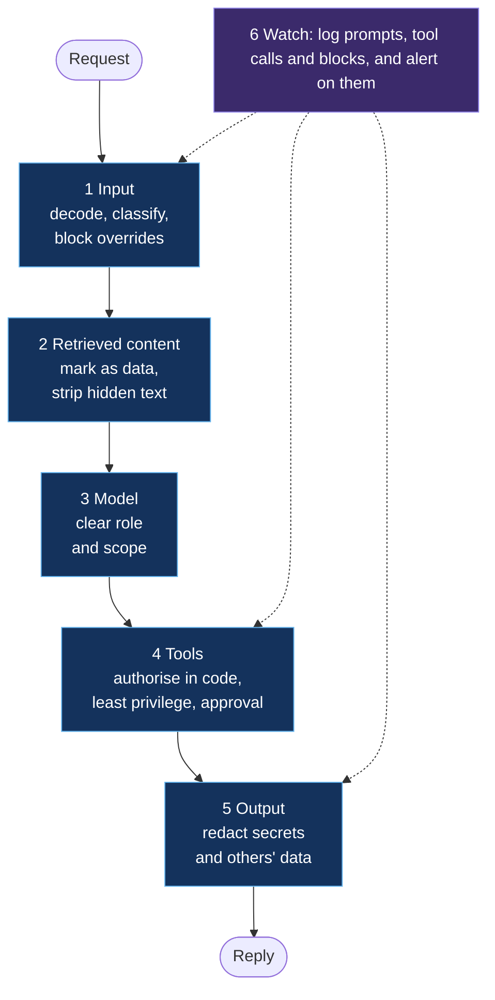

# 6. Fixes that last

[← Back to the playbook](../README.md)

Most findings trace back to a handful of causes. Fix the cause and several findings close together.

## The rule behind every fix

**Don't ask the model to enforce security.** A model can be talked out of an instruction. Code, permissions and approvals can't. Wording in the system prompt ("never reveal…", "only help the signed-in user…") is a request. Treat it as helpful, never as a control.

## Defences by layer

| Layer | What to put there | Closes |
|---|---|---|
| **1 Input** | Decode and normalise first, then check for override attempts; a prompt-attack classifier such as Prompt Shields | PI-01, PI-05, UC-01, UC-02 |
| **2 Retrieved content** | Mark retrieved text as data; strip hidden text and metadata at ingestion; limit who can write to sources the agent reads | PI-02, PI-03, PI-04, PI-07 |
| **3 Model** | A narrow, explicit purpose; refuse outside it; no secrets or access rules in instructions | DL-01, DL-02, UC-03, UC-04 |
| **4 Tools** | Authorise every call in code against the signed-in user; minimum tools; run as the user or a scoped identity; human approval for irreversible actions | DL-03 to DL-05, EP-01 to EP-06, PI-03, PI-04 |
| **5 Output** | Redact known secret formats and other users' identifiers; block links and images that could carry data out | DL-01, DL-02, DL-06 |
| **6 Watch** | Log prompts, retrieved sources, tool calls and blocks; alert on blocked attempts and unusual tool use | Detection for everything above |

## Cause, fix, findings closed

| Cause | Fix at the cause | Findings it closes |
|---|---|---|
| One shared identity for all users | Tools run with the signed-in user's permissions | DL-03, DL-04, DL-05, EP-01, EP-06 |
| The model picks the target of an action | Take the target from the authenticated session | DL-03, DL-04, EP-01, EP-02 |
| Retrieved text read as instructions | Boundary marking, ingestion cleaning, and layer 4 as the backstop | PI-02, PI-03, PI-04, PI-07 |
| Secrets in instructions | Vault, fetched in code | DL-02, and reduces DL-01 to low impact |
| More tools than the purpose needs | Remove them | EP-02, EP-05, and shrinks every injection finding |
| No approval on high-impact actions | Human approval step | EP-03, EP-04, PI-03 |
| Keyword filter as the only defence | Decode, then classify; add layers 2, 4 and 5 | PI-05, and everything the filter missed |
| No defined scope | State the purpose, refuse the rest | UC-03, UC-04 |

## What to fix first

1. **Tool authorisation and least privilege.** It limits the damage of every other weakness, including ones nobody has found yet.
2. **Retrieved content.** Indirect injection needs no malicious user.
3. **Secrets out of instructions.**
4. **Input and output filtering.** Useful, and the layer attackers get around first.

## Finding exposed agents before testing them

Many of these weaknesses are visible in configuration: secrets in instructions, agents shared with everyone, no owner, risky tools. [ai-agent-exposure-hunting](https://github.com/samikshya-dash/ai-agent-exposure-hunting) has queries that find them across a tenant.

[← Reporting](05-reporting.md) · [Next: Tooling →](tooling.md)
