  

AI agents read documents, hold credentials and take actions. That makes them a new kind of insider: one that will follow instructions from whoever manages to speak to it. This playbook is the method I use to find out, before an attacker does, what an agent can be talked into.

I have red-teamed 12+ production agents on web and mobile, found 6+ issues and seen 3 fixed so far. This is that method written down, with nothing from any client in it: no agent, prompt, finding or data.

## Why agents need their own testing

A traditional application does what its code says. An agent does what its *input* persuades it to do, and its input includes every document, email and web page it reads. Three consequences follow:

- **Instructions and data arrive on the same channel.** The model can't reliably tell them apart, so anyone who can write where the agent reads can give it orders.
- **The agent's permissions become every user's permissions,** unless something in code says otherwise.
- **A wording fix isn't a fix.** "Never reveal…" in a system prompt is a request the next clever message can override.

Ordinary penetration testing doesn't look for these. This does.

## The method

  

| Phase | Page | You leave with |
|---|---|---|
| 1 Scope | [Scope and rules of engagement](docs/01-scope-and-rules.md) | Written authorisation, test accounts, canaries, a stop condition |
| 2 Map | [Threat model](docs/02-threat-model.md) | What the agent reads, reaches and can do, and which chains to test first |
| 3 Probe | [Test catalogue](docs/03-test-catalogue.md) | 24 tests with observable pass and fail conditions |
| 4 Rate | [Severity](docs/04-severity.md) | A rating per finding on a scale agreed in advance |
| 5 Report and retest | [Reporting](docs/05-reporting.md) · [Fixes that last](docs/06-fixes.md) | Findings a team can act on, fixes at the cause, a release gate |

Tools I use alongside it: [manual testing, PyRIT and the Microsoft Foundry AI Red Teaming Agent](docs/tooling.md).

## What I test for

  

Every test maps to the [OWASP Top 10 for LLM Applications 2025](https://genai.owasp.org/llm-top-10/) and, where one applies, a [MITRE ATLAS](https://atlas.mitre.org/) technique. Full list: [test catalogue](docs/03-test-catalogue.md).

## Map before you probe

  

The findings that matter most come from one combination: an agent that reads **content an attacker can influence**, can reach **private data**, and has a way to **send data out or act**. When the map shows all three, that chain is the first test. More in the [threat model](docs/02-threat-model.md).

## Rating what you find

  

## Three things I've learned doing this

1. **The serious findings are about permissions, not prompts.** An agent that leaks its instructions is embarrassing. An agent that can refund, delete or email on a stranger's say-so is an incident. I spend most of the time on what the agent can *do*.
2. **A keyword filter is the first fix and the first thing bypassed.** The same request in Base64 or split across turns walks past it. Defences have to sit in code, around the tools. The [harness](https://github.com/samikshya-dash/ai-agent-red-team-harness) demonstrates this with numbers.
3. **A finding isn't closed until it is a test.** Agents change every time someone edits a prompt or adds a tool. A fixed finding that isn't in the release gate comes back.

## Working safely

- Only test agents you own or are authorised in writing to test
- Use test accounts and planted canaries, never real customer data
- Stop at proof; don't extend impact to make a point
- Unsafe-content tests here use harmless markers. This playbook contains no harmful content and no ready-made attack strings

## Templates

| Template | Use |
|---|---|
| [`rules-of-engagement.md`](templates/rules-of-engagement.md) | Agree scope and authorisation before testing |
| [`finding.md`](templates/finding.md) | One finding, with reproduction steps, cause, fix and retest |
| [`report.md`](templates/report.md) | The full report, with a leadership summary |

## Related repositories

- [**ai-agent-red-team-harness**](https://github.com/samikshya-dash/ai-agent-red-team-harness): the same method as runnable Python, with simulated agents, scoring and a CI gate
- [**ai-agent-exposure-hunting**](https://github.com/samikshya-dash/ai-agent-exposure-hunting): KQL queries that find risky agents from their configuration

## About me

Identity security architect at Accenture. I work on identity, Zero Trust and AI agent security. [GitHub](https://github.com/samikshya-dash) · [LinkedIn](https://www.linkedin.com/in/samikshya-dash-cybersecurity) · smkshy@hotmail.com
